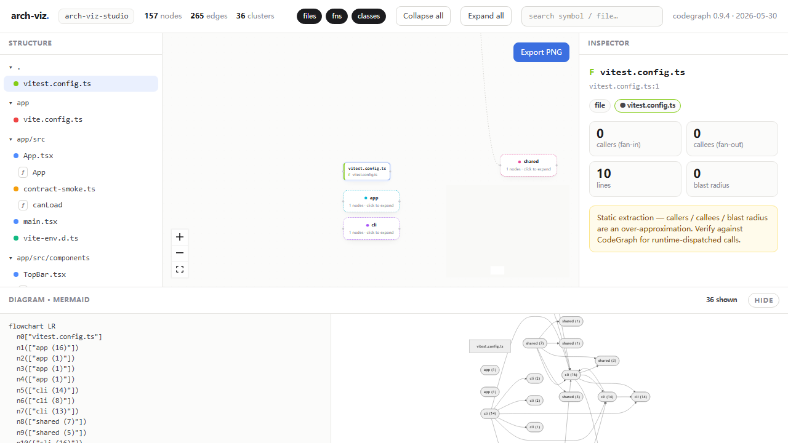

# arch-viz-studio

> Point it at any repo → a high-quality, **committable** architecture picture a human can present and an AI agent can read + update — with zero non-permissive licenses in the client-facing chain.

`arch-viz` is a **local, global CLI**. From inside any repository, one command produces both:

- an **interactive 4-pane viewer** (structure tree · graph · inspector · Mermaid diagram), and
- a **committable handoff bundle** in the target repo's `docs/architecture/`: `graph.json` · `architecture.svg` · `ARCHITECTURE.md` · `viz/index.html`.



> The bundle is the deliverable. `viz/index.html` is self-contained (one file, no install, no server) — double-click it and the architecture opens in any browser. `graph.json` is a versioned, deterministic, machine-readable contract an AI agent can read and safely annotate.

## Requirements

- **Node ≥ 22.12** (Node 22 or 24 LTS — not 25, whose V8 WASM JIT breaks CodeGraph)
- **CodeGraph CLI**: `npm i -g @colbymchenry/codegraph`

## Install — as a global `arch-viz` command

```bash
git clone https://github.com/kplliaoshen666-droid/arch-viz-studio.git
cd arch-viz-studio
npm install
npm run install:global      # bundles a single file + `npm i -g` it
```

Now `arch-viz` is on your PATH (only `better-sqlite3` is pulled as a runtime dep — a prebuilt binary, no compiler needed). Re-run `npm run install:global` to update after pulling changes.

> Prefer not to install globally? `npm run arch-viz -- scan <repo>` runs it straight from this repo.

## Use it

```bash
cd /path/to/any/repo
arch-viz scan               # scans the current directory → ./docs/architecture/
```

…or point it anywhere:

```bash
arch-viz scan /path/to/repo
arch-viz scan . --out build/arch     # custom output directory
arch-viz scan --no-sync              # reuse the existing CodeGraph index (skip re-index)
arch-viz --help
arch-viz --version
```

```
• CodeGraph 0.9.4 → syncing /path/to/any/repo
✓ bundle → /path/to/any/repo/docs/architecture
  157 nodes · 265 edges · 36 clusters
  files: graph.json · architecture.svg · ARCHITECTURE.md · viz/index.html
```

## How it travels into other projects / people

The **tool stays put** (here, in `tools/arch-viz-studio/`); only its **output** travels:

```
cd /path/to/your/project && arch-viz scan
   └─► <repo>/docs/architecture/
         ├─ graph.json        ← machines / AI agents / CI read this (documented, versioned schema)
         ├─ ARCHITECTURE.md    ← renders on GitHub
         ├─ architecture.svg   ← small, diff-friendly, embeds in a README
         └─ viz/index.html     ← double-click → interactive viewer, no install
```

Commit that folder (`git add docs/architecture`) and it rides along with the repo:

- **Teammates / clients** open `viz/index.html` directly — no install, no server, no `arch-viz-studio` present.
- **AI agents / tooling** read (and update) `graph.json`. An annotation an agent writes onto a node **survives the next `arch-viz scan`** (matched by stable, content-hash id).
- **Refreshing** is clean: re-scanning unchanged code is **byte-identical**, so `git diff` shows real architectural change, not regeneration noise.

## Explore interactively (in this repo)

```bash
npm run dev:app      # the full 4-pane viewer at http://localhost:5173
```

Click any node to inspect callers, callees, imports, and blast radius; toggle node kinds; search; **Expand all / Collapse all**. Large graphs (> 80 nodes) open **collapsed by cluster** for readability — click a cluster to drill in. The default demo is this tool's own 157-node self-scan.

## Layout

| Package | Role |
|---|---|
| `shared/` | the `graph.json` contract — types, JSON Schema, `validate()`, `canonicalize()`. Single source of truth (see [`shared/README.md`](./shared/README.md)). |
| `cli/` | `arch-viz scan` — runs CodeGraph, reads its SQLite DB, normalizes (dedupe · seeded Louvain · metrics · dagre), emits the bundle. |
| `app/` | Vite + React + React Flow 4-pane viewer + in-browser PNG export. |

## Commands

```bash
npm run install:global   # build the single-file bundle + install the global `arch-viz` command
npm run build:cli        # just build the bundle (cli/dist/arch-viz.mjs)
npm run arch-viz -- scan <repo>   # run from this repo without a global install

npm test                 # vitest — schema · CLI pipeline · prompt-driven contract · viewer logic · adversarial escaping
npm run test:e2e:install # one-time: download Playwright Chromium
npm run test:e2e         # Playwright E2E of the 4-pane viewer
npm run typecheck        # tsc across all packages
npm run lint:licenses    # SEC-01 — fails if any shipped dep is non-permissive
npm run dev:app          # interactive viewer
npm run build:app        # production build of the viewer
```

## Guarantees

- **Deterministic** — re-scanning unchanged code yields a byte-identical bundle (clean git diffs). Verified end-to-end by the prompt-driven contract suite.
- **Safe** — subprocesses run without a shell; only a trusted (global) CodeGraph is run unless you pass `--use-target-codegraph`; writes are confined to the target repo; all code-derived text in the SVG/HTML/Markdown is escaped (adversarial-symbol tested).
- **Permissive-only** — the client-facing chain is 100% MIT / ISC / BSD / Apache-2.0 / MPL-2.0; a CI gate fails the build on anything else. (GitNexus — PolyForm Noncommercial — is deliberately excluded.)

## Tests

Three layers:

1. **Unit** (Vitest) — normalize / emit / schema, fully offline.
2. **Prompt-driven CLI contract** (Vitest) — drives the real bundled `arch-viz scan` end-to-end: schema validity, byte-for-byte determinism, cwd-default, annotation round-trip, self-contained viewer. Skips automatically where the CodeGraph CLI isn't installed.
3. **Playwright E2E** — the 4-pane viewer renders, the inspector populates on click, expand/collapse changes the canvas, search filters the tree.

## License

MIT © Ruixuan Liao — see [LICENSE](LICENSE).
