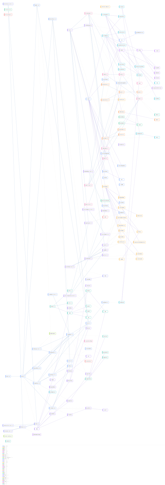

# Architecture — arch-viz-studio

> `arch-viz` v0.1.0 · engine codegraph 0.9.4 · **157** nodes · **265** edges · **36** clusters · source `git:eac68a7ff0b2bb3c5cf9c0dfc32e01933203e9cf`

## ⚠️ Static-extraction caveats

- Built by **static analysis** (tree-sitter via CodeGraph). It is an *over-approximation*: dynamic dispatch, reflection, and runtime wiring may be missing or imprecise.
- `calls` edges and blast-radius are structural, not a runtime guarantee — verify in CodeGraph for critical decisions.
- Regenerate with `arch-viz scan` after code changes; do not hand-edit anything except `annotations`.

## Clusters

| # | Cluster | Nodes |
|--:|---|--:|
| 0 | app | 16 |
| 1 | app | 1 |
| 2 | app | 1 |
| 3 | app | 1 |
| 4 | cli | 14 |
| 5 | cli | 8 |
| 6 | cli | 13 |
| 7 | shared | 7 |
| 8 | shared | 5 |
| 9 | vitest.config.ts | 1 |
| 10 | cli | 16 |
| 11 | cli | 4 |
| 12 | cli | 2 |
| 13 | cli | 14 |
| 14 | cli | 14 |
| 15 | cli | 1 |
| 16 | cli | 1 |
| 17 | app | 15 |
| 18 | app | 1 |
| 19 | cli | 1 |
| 20 | shared | 3 |
| 21 | cli | 1 |
| 22 | shared | 3 |
| 23 | cli | 2 |
| 24 | cli | 1 |
| 25 | app | 1 |
| 26 | cli | 1 |
| 27 | app | 1 |
| 28 | shared | 1 |
| 29 | shared | 1 |
| 30 | app | 1 |
| 31 | app | 1 |
| 32 | shared | 1 |
| 33 | cli | 1 |
| 34 | app | 1 |
| 35 | cli | 1 |

## Key nodes (by connectivity)

| Symbol | Kind | Path | Fan-in | Fan-out |
|---|---|---|--:|--:|
| `main` | function | `cli/src/bin.ts` | 1 | 10 |
| `buildGraph` | function | `cli/src/normalize/buildGraph.ts` | 2 | 8 |
| `writeBundle` | function | `cli/src/emit/writeGraph.ts` | 1 | 9 |
| `writeGraphFile` | function | `cli/src/emit/writeGraph.ts` | 0 | 6 |
| `App` | function | `app/src/App.tsx` | 0 | 6 |
| `validate` | function | `shared/src/validate.ts` | 5 | 0 |
| `toSvg` | function | `cli/src/export/toSvg.ts` | 2 | 3 |
| `main` | function | `cli/test/fixtures/sample-repo/index.ts` | 1 | 4 |
| `computeView` | function | `app/src/derive/viewModel.ts` | 1 | 4 |
| `canonicalize` | function | `shared/src/canonicalize.ts` | 3 | 1 |
| `clusterNodes` | function | `cli/src/normalize/cluster.ts` | 1 | 2 |
| `build` | function | `cli/test/determinism.test.ts` | 0 | 3 |

*Schema 1.0.0 · generated 2026-05-30T22:59:27.319Z · machine-readable graph in [graph.json](./graph.json) · open [viz/index.html](./viz/index.html) (no install).*
